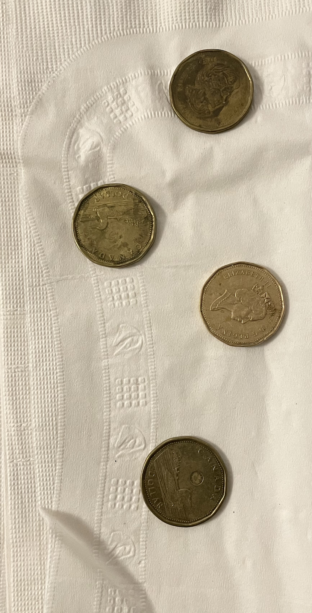

<h1>Coin Value Recognition via Computer Vision</h1>

This program uses Python's openCV library to detect and recognize coins on a smooth surface background. The program recognizes the coins and their respective value by taking into account their circular dimensions (radii) and their colour composition. Initially the image is turned black and white to maintain colour constraint; and in that state, the differeing whiteness intensities are used to identify which specific coin the computer is looking at (since each coin value will have different black/white intensity when looked at monochromatically).

The dollar value of each coin with respect to their dimension and colour intensity is hard coded into the program, and when detected, will call upon those values. These values will be read via functions from the NumPy library. The total of such values then, once detected, are added and returned to the user.

Renders of before and after images (before and after recognition):

***Project is not complete yet, will add more functions as I go.

